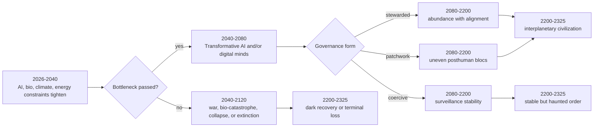

# Nexus Project Lore Guidance for World in 2325

## Reference status

Preserved from `03_Reference/lore_guidance/40_Nexus_Project_Lore_Guidance_for_World_in_2325_rev1.md`. Use as worldbuilding reference only. Active lore authority lives in the rebuilt `Lore` domain.

---

# Nexus Project Lore Guidance for the World in 2325

Status: Stable Reference Guidance  
Revision: 1.0  
Package: Stable  
Created: 2026-05-04 08:42 CDT  
Steward Note: This is a low-churn research/lore guidance reference. It is not itself binding Nexus canon. Canon consequences should be promoted later through Seed, Draft/Workbench, and Steward placement. Citation/entity markers are preserved from the source text for traceability and should be converted to a durable bibliography before publication.

## Executive Summary

Very few serious futurists publish **explicit** 300-year forecasts. The strongest primary sources instead do one of three things: they model the **civilizational bottleneck of the next century**, they sketch **posthuman discontinuities** that would make ordinary trend extrapolation invalid, or they describe the **physics, governance, and ethical constraints** that would still shape any world three centuries out. That means the most rigorous way to build lore for the year **2325** is not to ask “what gadgets exist then?” but “which transition path wins between now and roughly 2125?” citeturn16view0turn25view0turn19search0turn16view17

Across the highest-value sources, the strongest convergence is this: if civilization survives, **status-quo modernity probably does not**. The long-run world is likely to be posthuman in some important sense, whether through advanced AI, human-machine merger, digital minds, radical biotech, or fabrication systems that make matter itself more programmable. The biggest disagreements are not over whether change arrives, but over whether it is **aligned or runaway, centralized or plural, abundant or stratified, biological or computationally emulated**. citeturn21view0turn34view0turn41view0turn23view0turn38search5

For lore design, the most defensible “most likely” frame is **patchwork posthumanity**: a world where existential catastrophe was avoided but not cleanly; coastlines remain permanently reworked by climate legacy; biological humans still exist but are no longer civilization’s sole reference class; archives, verification rituals, identity law, and compute governance matter as much as weapons once did; and the sky shows visible signs of orbital industry or energy capture even if interstellar expansion remains nascent. That framing best matches the overlap between risk-focused, accelerationist, emulation-first, nanotech, and civilizational-durability schools. citeturn28view0turn28view2turn29search6turn16view15turn44view0turn17view1turn34view0

The core design lesson for **Nexus Project** is therefore this: build the future as a place where **meaning, legitimacy, and continuity** are contested as fiercely as territory once was. The most interesting 2325 is not merely “more advanced”; it is a world living with the consequences of having crossed thresholds its ancestors only dimly understood. That is exactly where the best futurists place the center of gravity. citeturn33view0turn35view2turn41view0turn44view0

## Priority Forecasters and Institutions

Direct century-scale forecasts are rare, so the ranking below weights **rigor, influence, explicit relevance to multi-century futures, and how conservatively their views can be extended to 2325**. citeturn25view0turn16view0

### Priority futurists

1. **entityNick Bostrom** — Highest priority because he provides the cleanest taxonomy of long-run outcomes and the strongest governance logic for why technological progress can become civilizationally unstable. He argues that “a few hundred years” can already be enough for extinction, collapse, plateau, or posthumanity to play out, and his newer work frames success as a “post-instrumental” solved world where labor is obsolete and the central problem becomes meaning. Conservative extrapolation to 2325: ordinary industrial modernity is unlikely to survive unchanged; if civilization survives, it probably becomes either deeply posthuman, tightly governed, or both. Primary anchors: entityDeep Utopia, plus his papers on humanity’s future, astronomical waste, and the vulnerable world. citeturn16view0turn33view0turn17view1turn41view0

2. **entityToby Ord** — Highest priority for the “bottleneck first” view. His official materials characterize the present era as one where safeguarding humanity’s long-term potential is urgent, and his FAQ gives a “one-in-six chance of existential catastrophe over the next century.” Conservative extrapolation to 2325: the single most important determinant of the year 2325 is whether the 21st and early 22nd centuries successfully navigate existential risk. Primary anchor: entityThe Precipice and the official FAQ. citeturn16view1turn19search0turn19search2

3. **entityRay Kurzweil** — Still the most explicit and widely cited accelerationist. His official Q&A says, “I set the date for the Singularity … as 2045,” with nonbiological intelligence becoming vastly more powerful than current human intelligence, nanorobots entering bodies and brains, longevity expanding, and information technologies becoming extremely cheap. Conservative extrapolation to 2325: if his broad acceleration logic is even half-right, 2325 is a mature human-machine civilization where biology is optional rather than definitive. Primary anchor: entityThe Singularity Is Near and the official Q&A. citeturn21view0turn16view3

4. **entityRobin Hanson** — The most detailed social forecast of a radically non-human economy. His official book site says brain emulations could arrive “within perhaps a century,” displacing humans in most jobs, with economies doubling in weeks, dense compute cities, copy-based labor, and radically altered norms around identity, wages, death, and law. Conservative extrapolation to 2325: if whole-brain emulation or similar digital-person technology arrives before fully general AI, the world becomes socially alien long before it becomes physically exotic. Primary anchor: entityThe Age of Em and his follow-up posts. citeturn34view0turn16view2

5. **entityAnders Sandberg** — Best on physics-constrained grand futures, space settlement, and the scale of what civilization could become if it survives. In his own report he analyzes “very fast large-scale settlement,” and elsewhere he explicitly points to “stellar settlement, the intergalactic settlement, then the ultimate limits of physics.” Conservative extrapolation to 2325: a mature solar-system civilization is plausible; the beginnings of interstellar projects cannot be ruled out. citeturn16view6turn36search2

6. **entityMax Tegmark** — Best on AI alignment, distributional ethics, and the cosmic-value perspective. He says superhuman AI could be “either the best thing ever … or the worst thing,” and links the future of intelligence to the future of value in the cosmos. Conservative extrapolation to 2325: if conscious life spreads and remains aligned, the moral status of digital minds and the distribution of AI-generated abundance become civilizational first-order questions. Primary anchor: entityLife 3.0 and the official transcript. citeturn35view2turn16view4

7. **entityK. Eric Drexler** — Highest priority on atomically precise manufacturing and the material basis of civilization. In his nanotech canon he argues such systems could bring changes “as profound as the industrial revolution, antibiotics, and nuclear weapons all rolled up in one,” while later official talk descriptions say high-throughput atomically precise manufacturing could radically lower the cost of what people want and alter the economy-environment relationship. Conservative extrapolation to 2325: if this path matures, matter becomes partly software-like, with huge gains in clean manufacture, infrastructure, medicine, and military capability. Primary anchors: entityEngines of Creation and entityRadical Abundance. citeturn39view0turn40view1turn38search5turn38search0

8. **entityVernor Vinge** — Less reliable on exact timing, still indispensable on discontinuity. His 1993 paper says, “Within thirty years, we will have the technological means to create superhuman intelligence,” and that developments once thought to require “a million years” could happen in the next century. Conservative extrapolation to 2325: if a true intelligence explosion happens, detailed social forecasting beyond the transition is weak by design; only the existence of a post-human rupture is robust. citeturn23view0turn24view1

### Priority institutions

The most relevant organizations are valuable less because they forecast an exact year 2325 and more because they define the **institutions, roadmaps, and conceptual frames** within which a 2325 world would emerge.

- **entityFuture of Humanity Institute** — Historically the deepest academic archive for existential risk, longtermism, AI governance, anthropics, and “grand futures.” Its official closure notice says it helped legitimize rigorous work on humanity’s future and seeded many of today’s deep-future fields. citeturn44view2

- **entityFuture of Life Institute** — The most visible current institution focused on steering transformative technology toward beneficial outcomes and away from extreme risk. Its official materials center AI existential safety, governance, and positive long-run futures. citeturn16view10turn35view0

- **entityLong Now Foundation** — Essential for civilizational-timescale thinking, resilience, and the aesthetics of durability. Its official clock project explicitly adopts a 10,000-year frame, and its essays argue that fast and slow layers together make civilization resilient. citeturn16view9turn44view0

- **entityForesight Institute** — The most relevant organization for nanotech, longevity biotech, neurotechnology, secure AI, space, and “existential hope.” It is less conservative than the academic longtermist institutions but very valuable for technological world texture. citeturn44view1turn43search1

- **entityGlobal Priorities Institute** — Important not for gadget forecasts but for the ethical and institutional logic of how current choices affect the long-run future. Its archived mission and agenda remain useful for how to think about intergenerational prioritization. citeturn16view11turn4search4

- **entityThe Millennium Project** — Still useful for scenario method, governance stress-testing, and comparative foresight, even though its flagship public scenarios are usually shorter than three centuries. citeturn16view12turn3search11

## What They Imply About the State of the World in 2325

**Society and governance.** The deepest convergence is that governance capacity, not gadget count, becomes decisive. One influential line of reasoning says some future technologies could make civilization “devastated by default” unless preventive policing and global governance improve; another says durable civilizations survive because slow layers such as culture, governance, and nature absorb shocks that faster layers generate. Read together, these sources imply that the world of 2325 is unlikely to be libertarian in today’s sense. It is more likely to feature thick coordination systems around AI, biotech, identity, copy-rights, verification, and high-risk fabrication — whether those systems are formal states, cloud polities, treaty regimes, or sacred customary orders. citeturn41view0turn42view1turn44view0turn19search0

**Economy, labor, materials, and energy.** The future economy is not consistently imagined as “more capitalism” or “more socialism”; it is imagined as a civilization in which labor scarcity breaks. The accelerationist branch expects AI and nanotech to collapse the cost of many goods and services. The emulation branch expects explosive growth, ultra-cheap digital labor, dense compute geographies, and low wages for copied minds. The nanotech branch expects manufacturing to become cleaner, radically cheaper, and more precise. In every branch, the key scarcities shift toward compute, energy throughput, strategic coordination, and access to fabrication rights or protected substrates. That implies a 2325 economy organized less around factory production and more around **control of intelligence, matter design, and trusted infrastructure**. citeturn21view0turn34view0turn40view1turn38search5

**Environment, climate, and demography.** Near-term baseline institutions matter here more than futurists do. Official demographic projections currently run only to 2100 and project a peak around the mid-2080s followed by gradual decline, which already points toward an aging and regionally uneven century before any posthuman transition is added. Climate legacy is even more persistent: the physical-science assessment says sea-level rise and ocean warming continue for centuries to millennia, with substantial uncertainty even by 2300. The energy baseline points toward a more electrified and renewable-heavy system this century, but the long-run futurists imply far larger energy demand if compute, AI, orbital industry, or molecular manufacturing scale as expected. So the 2325 environment is unlikely to be a “restored Earth.” It is more plausibly an **engineered Earth**: armored coasts, relocated populations, managed hydrology, and many layers of adaptation embedded into daily life. The official baselines from entityUnited Nations, entityIntergovernmental Panel on Climate Change, entityInternational Energy Agency, and entityNASA are the right anchors for this part of the lore. citeturn29search6turn29search0turn28view0turn28view2turn14search22turn16view15

**AI, biotech, nanotech, space, culture, religion, and ethics.** The strongest long-run cluster expects intelligence expansion to dominate the next centuries: either via general AI, human-machine merger, or digital emulation. Biotechnology and longevity matter both as independent revolutions and as substrates for identity politics once aging, enhancement, or consciousness engineering become tractable. Space expansion is treated by several of the highest-ranked sources not as decorative worldbuilding but as a genuine civilizational branch, morally weighty because it changes the amount and distribution of future conscious life. Culture and religion do not disappear in these visions. They become more important, because once labor and scarcity are technologically softened, legitimacy, identity, and meaning stop being peripheral questions. One line of thought openly treats evolution toward intelligence as spiritually significant; another asks what meaning remains after success itself has solved the old material problems. A credible 2325 therefore has more ritual, more philosophy, and more identity law than a simplistic “post-scarcity” future usually admits. citeturn21view0turn35view2turn33view0turn36search2turn17view1turn44view0

## Where They Converge and Diverge

The sources converge on **transformation**, but they disagree sharply on its social form. Four fractures matter most for lore. citeturn25view0turn21view0turn34view0turn23view0

First, there is the split between **alignment-first** and **acceleration-first** futures. In one vision, intelligence amplification is only good if values, governance, and distribution keep pace. In another, technological acceleration itself is the great civilizational engine and social problems mostly yield to abundance and adaptation. citeturn35view2turn21view0

Second, there is the split between **AI-first** and **em-first** posthumanity. Some sources assume abstract machine intelligence wins first; others expect brain emulations or biologically anchored digital minds to dominate the transition. These lead to radically different lore. AI-first worlds center alignment, control, and machine sovereignty. Em-first worlds center copy law, wage collapse, authenticity, retirement, deletion, and dense compute urbanism. citeturn21view0turn34view0

Third, there is the split between **centralized guardianship** and **adaptive plurality**. One camp thinks increasingly dangerous technologies eventually force heavy surveillance, unipolar order, or far stronger global coordination. Another implies civilization remains resilient precisely because multiple layers and institutions evolve at different speeds rather than collapsing into a single optimizing center. citeturn41view0turn42view1turn44view0

Fourth, there is the split between **abundance as liberation** and **abundance as hierarchy**. Cheap matter, cheap intelligence, and long life do not automatically produce equality. In several futures, abundance is real but access, rights, and legitimacy remain strongly stratified. That is one reason the best lore should not assume that material progress dissolves politics. citeturn38search5turn34view0turn35view3

The matrix below translates those differences into lore-relevant dimensions. It uses the priority numbers from the ranked list above.

| Priority | Main discontinuity | Governance tendency | Economic image | Space image | Long-run mood |
|---|---|---|---|---|---|
| 1 | Posthumanity or solved world | Stronger coordination; maybe much stronger | Value and meaning after labor | Morally weighty expansion | Philosophical, high-stakes |
| 2 | Civilizational bottleneck | Risk reduction first | Preserve option value | Secondary to survival | Guarded hope |
| 3 | Singularity and merger | Tech-led, relatively optimistic | Cheap intelligence and abundance | Extension of acceleration | Triumphal, spiritualized |
| 4 | Brain emulations | Competitive, market-heavy | Fast growth, low digital wages | Limited in core scenario | Weird, adaptive, unequal |
| 5 | Grand futures under physics | Coordination matters | Wealth rises with capability | Solar to interstellar | Vast, exploratory |
| 6 | AI as best-or-worst branch | Alignment and distribution first | Shared bounty or concentrated power | Cosmic flourishing possible | Binary, morally charged |
| 7 | Atomically precise fabrication | Governance questions intensify | Matter becomes cheap/designable | Space industry enabled by fabrication | Abundant but strategic |
| 8 | Intelligence explosion | Timing overwhelms institutions | Transition compresses centuries | Posthuman, difficult to model | Awe plus loss of control |

That matrix is a synthesis of the primary sources above, not a separate independent dataset; it is meant as a lore-design compression layer. citeturn16view0turn19search0turn21view0turn34view0turn36search2turn35view2turn40view1turn23view0

## Scenario Archetypes for Nexus Project

The most useful working assumption is that **2026–2125 is the decisive century-in-miniature**. Expert AI-timeline surveys have shortened materially, official demographic projections bend within this century, official climate assessments extend consequences for many centuries, and the long-run trajectory literature explicitly argues that long-term status quo persistence is unlikely. citeturn16view17turn29search6turn28view0turn25view0

The branch points in that diagram come directly from the combined logic of existential-risk work, singularity scenarios, emulation scenarios, space-settlement analysis, and current baseline institutions. citeturn19search0turn41view0turn23view0turn34view0turn16view6turn16view17turn28view2

**Stewarded ascent** is the best-case branch. Probability: **about 20%**, low confidence. The 2030s–2060s are dominated by AI and biotech governance, not merely by model releases. The late 21st and 22nd centuries see aligned machine intelligence, strong anti-catastrophe institutions, clean high-throughput manufacturing, and self-sustaining off-world industry. By 2325, civilization is plural, advanced, and morally self-aware enough to resist both nihilism and coercive simplification. Lore motifs: cool ceramic archive-vaults, orbital mirrors moving like weather, treaty glyphs on city seawalls, old biological neighborhoods preserved as sacred commons, and low-drama abundance that still carries ritual seriousness. citeturn19search0turn35view2turn38search5turn16view15turn44view0

**Patchwork posthumanity** is the most defensible “most likely” branch. Probability: **about 35%**, low confidence. Catastrophe is avoided, but unevenly. Some zones become AI-rich and fabrication-rich; others remain adaptation economies living with sea walls, migration compacts, and inherited ecological damage. Biological humans remain visible, but not socially central everywhere. Identity law becomes thick: copies, forks, restored persons, machine custodians, and baseline lineages all negotiate legitimacy. Lore motifs: armored littorals, hot compute cloisters, verification shrines, memory audits, black-market authenticity certificates, inner-system freight lanes visible as moving stars, and old city centers elevated onto buttressed terraces above drowned sublevels. citeturn28view0turn28view2turn34view0turn41view0turn44view0

**The burned century** is the clearest worst-case branch. Probability: **about 30%**, low confidence. The bottleneck fails through some interaction of AI misalignment, engineered biology, war, or cascading governance failure. The terminal version is extinction or permanent blight; the recoverable version is a civilization that survives only by mythologizing and tightly tabooing the technologies that nearly ended it. A 2325 recovery civilization on this branch would feel less like sleek futurism and more like a world of quarantined knowledge, ritualized restraint, and heavily moralized engineering. Lore motifs: wind-scoured exclusion belts, preserved dead data centers treated like cursed ruins, sterile gene monasteries, oral proscriptions against certain kinds of synthesis, and rusted coastal megastructures half-claimed by salt and lichen. citeturn19search0turn41view0turn42view1turn28view2

**The em world or the leviathan** is the most valuable wildcard branch. Probability: **about 15%**, low confidence. If whole-brain emulation arrives before generalized machine autonomy, civilization may reorganize around fast copies, temporary workers, strange retirement, deletion rites, and dense thermal cities. If vulnerable-world dynamics dominate instead, the result may be long-run stability under exhaustive monitoring justified by historical memory of near-annihilation. These two worlds look different politically but similar emotionally: both are futures where freedom, personhood, and continuity become deeply negotiated. Lore motifs: millimeter-scale embodied agents in cathedral-hot processor towers, legal distinctions between originals and runs, authenticated silence zones where no copying is allowed, and social prestige attached to provable unmodified memory chains. citeturn34view0turn16view2turn41view0

For **Nexus Project**, the richest visual grammar is the combination of **fast and slow**. Let the fast layer be swarms, fabrication, synthetic intellects, and orbital traffic; let the slow layer be stone archives, legal oaths, ancient coastworks, genealogical memory, and ritualized authenticity. That dual-speed world is more faithful to the sources than either chrome utopia or rubble dystopia alone. citeturn44view0turn34view0turn16view15turn28view0

## Probabilities, Limitations, and Primary Source Stack

The table below is **not a consensus forecast**. It is a conservative synthesis from the ranked futurists above combined with current official baselines on demographics, climate, energy, and space. Confidence is inherently limited by the time horizon. citeturn25view0turn29search6turn28view0turn16view15

| Major outcome by about 2325 | Recommended probability | Confidence |
|---|---:|---|
| Civilization avoids human extinction | 60% | Low-medium |
| Some form of deep posthuman transition occurs | 70% | Low-medium |
| AI-like systems are central to governance and production | 65% | Medium |
| Biological baseline humans remain the dominant sentient population | 15% | Low |
| Digital minds or em-like persons become a major civilizational class | 35% | Low |
| Atomically precise manufacturing or an equivalent fabrication revolution becomes ordinary somewhere | 45% | Low |
| Self-sustaining off-Earth settlements exist | 60% | Low-medium |
| Interstellar probes or early extrasolar settlement attempts exist | 35% | Low |
| Climate and sea-level adaptation remain civilizationally central | 80% | Medium |

These weights mostly reflect three judgments: the near-term bottleneck appears real; the status quo appears historically fragile; and, conditional on survival, intelligence expansion is more likely than technological stasis. citeturn19search0turn25view0turn16view17turn28view0

### Recommended primary source stack

If you only read a small high-credibility stack for lore development, prioritize these in order.

1. **Priority 1 source set** — the humanity-future paper, the astronomical-waste paper, the vulnerable-world paper, and the 2024 solved-world page. Best for existential stakes, governance architecture, and what “success” still leaves unresolved. citeturn16view0turn17view1turn41view0turn33view0  
2. **Priority 2 source set** — the official book page and FAQ. Best for the bottleneck framing and quantitative existential-risk estimate. citeturn16view1turn19search0turn19search2  
3. **Priority 3 source set** — the official home page and Q&A. Best for explicit accelerationist timelines, human-machine merger, nanomedical imagery, and abundance assumptions. citeturn16view3turn21view0  
4. **Priority 4 source set** — the official book site and the follow-up confidence post. Best for copy-ridden society, digital labor, extreme growth, and social weirdness. citeturn34view0turn16view2  
5. **Priority 5 source set** — the space-races report and the grand-futures material. Best for solar-system and interstellar scaling under physical constraints. citeturn16view6turn36search2  
6. **Priority 6 source set** — the official transcript. Best for the “best-or-worst” framing, alignment imperative, and cosmic-value perspective. citeturn35view2turn16view4  
7. **Priority 7 source set** — the nanotech canon and the Oxford Martin materials. Best for fabrication, materials, abundance, and environmental-economic transformation. citeturn39view0turn40view1turn38search5turn38search0  
8. **Priority 8 source set** — the 1993 singularity paper. Best for posthuman discontinuity, prediction-horizon humility, and the sense that centuries can compress into decades. citeturn23view0turn24view1  
9. **Baseline reality set** — official demographic, climate, energy, and near-space planning sources. Best for grounding the next 50–250 years of any scenario in something firmer than pure speculation. citeturn29search6turn28view0turn28view2turn14search22turn16view15  
10. **Civilizational method set** — the long-term trajectories paper plus the Long Now essays. Best for turning forecasts into world structure and social texture. citeturn25view0turn44view0turn16view9  

**Open questions and limitations.** Explicit 300-year forecasts remain rare; several of the most useful sources are really forecasts for discontinuities expected this century or the next. The detailed Drexler material was partly accessed through redistributed scans and official Oxford descriptions rather than a fully navigable author site. The Vinge timeline has aged badly in one sense, but the discontinuity logic remains influential. Demography past 2100 and the social consequences of aligned superintelligence remain especially under-modeled. Treat any single sharp claim about the year 2325 as suspect; treat **scenario families** as the reliable unit of lore design. citeturn25view0turn23view0turn29search11turn33view0

