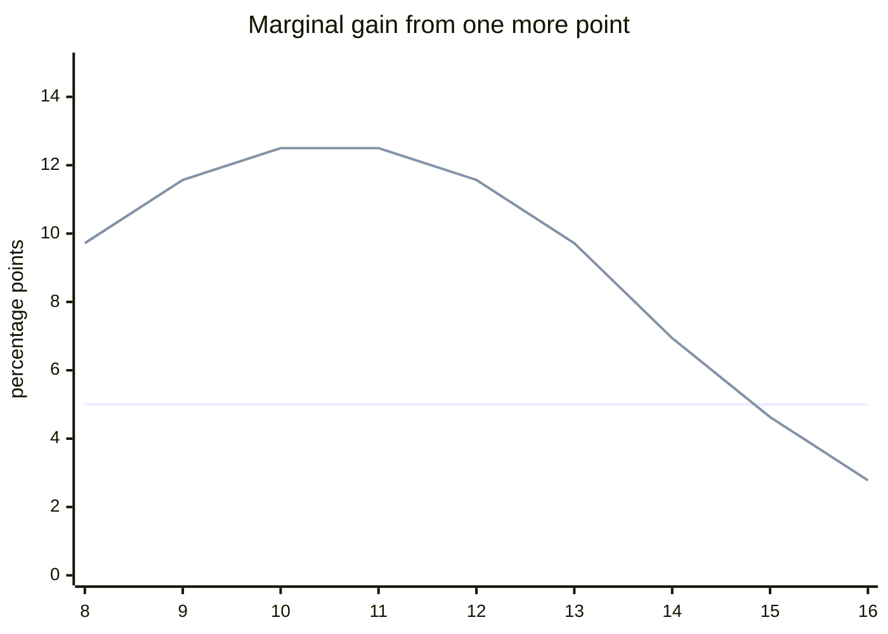
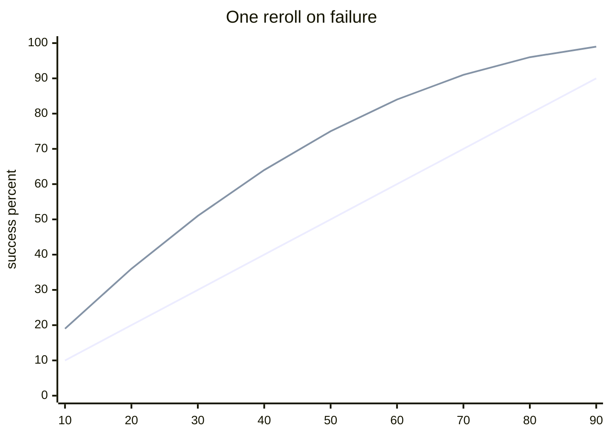
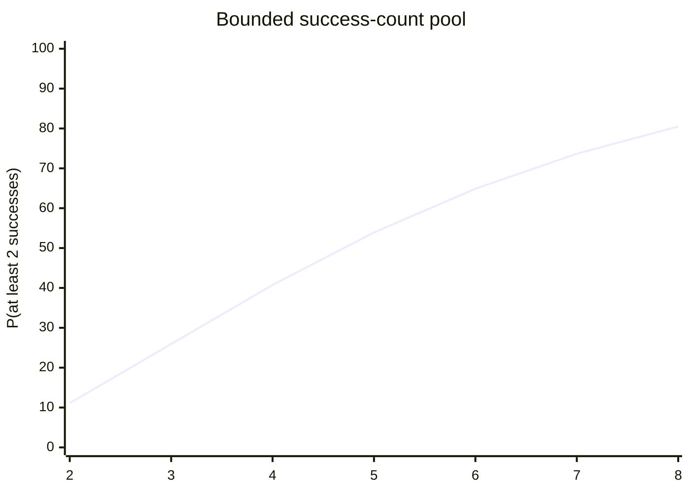
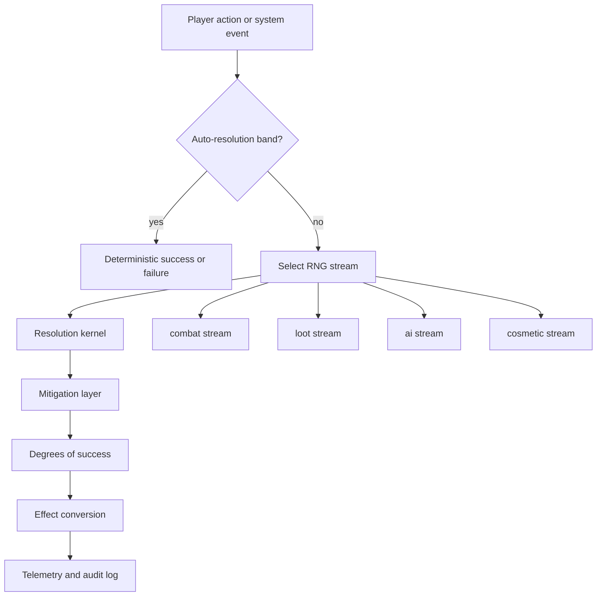
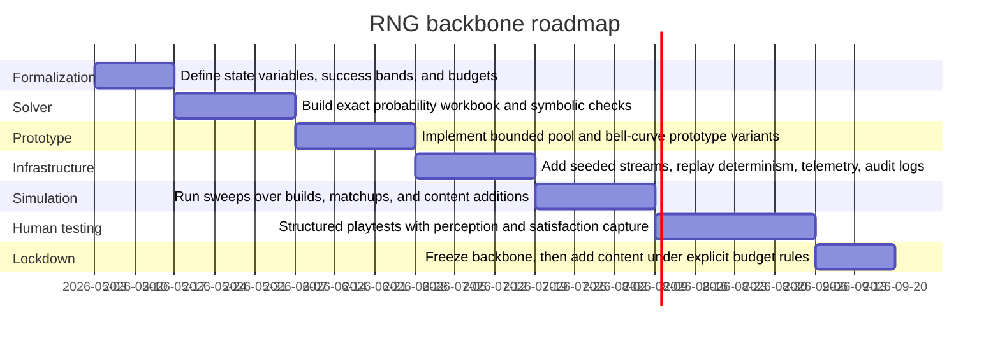

# Deep Research Report

## Reference status

Preserved from `03_Reference/source_materials/deep-research-report.md`. This is broad research evidence, not active source authority.

---

# RNG and Balance Backbone for Tabletop and Video Games

## Executive summary

Randomness is not a peripheral choice. It is a structural choice that determines how balance, content scalability, perceived fairness, and build diversity behave over the lifetime of a game. Academic balance research, industry playtesting literature, and design talks all converge on the same point: balancing is difficult precisely because randomness, fairness, depth, and variety interact rather than vary independently. Designers who treat RNG as “just a resolution mechanic” almost always inherit harder downstream problems in content tuning and dominant-strategy control. citeturn20view0turn21view4turn20view2turn20view4turn35view3

The strongest high-level conclusion from the literature and from the mathematics is this: **for a long-lived system that must support many archetypes and expansions, the safest backbone is a bounded, parameterized RNG family whose marginal gains are mathematically capped and whose variance-control tools are resource-gated rather than free.** Linear one-die systems are easy to teach but are the least forgiving under power creep; exploding mechanics are excellent spectacle generators but poor baseline balance substrates; bell curves and bounded dice pools are far more stable for incremental content growth. Official tabletop rules illustrate the major families clearly: D20 tests and advantage/disadvantage in *D&D*; percentile roll-under with bonus/penalty dice in *Call of Cthulhu*; centered 4dF in *Fate*; highest-of-pool d6 in *Blades in the Dark*; exploding dice, Bennies, and card initiative in *Savage Worlds*; and symbol dice in *Genesys*. citeturn29view0turn13view0turn33search1turn29view1turn30view0turn12view0turn35view4

For a project that wants broad character expression, extensibility, and resistance to dominant strategies, the best **non-authoritative** recommendation is a **bounded success-count dice pool** for primary resolution, combined with **resource-based mitigation** and **deterministic or low-variance effect conversion** after the roll. In digital implementations, that should sit on top of **deterministic, seedable, subsystem-separated random streams** using modern generators suited to testing, replay, and parallelism, rather than ad hoc global RNG state. Official engine docs and RNG papers support deterministic state capture, independent streams, and careful generator choice; modern papers also show why testing suites such as TestU01 matter, and why stream-oriented generators such as PCG and Random123-style counter-based PRNGs are appealing for games that need reproducibility and scale. citeturn20view6turn27search0turn20view10turn20view11turn20view8turn19search13

**Status note:** the design options in the recommendation sections below are **not authoritative**, **not project canon**, and **not sources of truth**. They are working hypotheses and parameter sets meant for prototyping, simulation, and playtest falsification.

## Literature survey and taxonomy

The foundational literature separates into three clusters. The first cluster is about **RNG quality and implementation**: entityMakoto Matsumoto and Takuji Nishimura’s Mersenne Twister paper established a long-period, fast uniform PRNG that became a standard reference point; Pierre L’Ecuyer and Richard Simard’s TestU01 framework made large-scale empirical testing of RNG quality practical; Melissa O’Neill’s PCG paper argued for generators that simultaneously optimize statistical quality, speed, and small-state practicality; Salmon et al.’s Random123 work showed why counter-based generators are attractive for parallel simulation; and NIST SP 800-90A formalized deterministic random bit generators for security-sensitive settings. citeturn38search0turn19search13turn40view2turn20view10turn40view3turn40view4turn20view11turn40view1turn20view8

The second cluster is about **balance evaluation and automated playtesting**. Jaffe et al. framed balance as a quantitative problem involving fairness, randomness, and variety, and demonstrated “restricted play” as a way to detect overpowered or underpowered options before human testing. Pfau and Seif El-Nasr synthesized academic and industry notions of balance and argued that viability, diversity, and player perception all matter; their conclusion explicitly warns against dominating choices that render alternatives irrelevant. Dungeons & Replicants and related work show how agent-based or model-based simulation can surface balance differences before a studio commits to large human-playtest budgets. Andrade et al. linked dynamic game balancing to player satisfaction and argued that adaptive approaches can outperform static difficulty selection. Valve’s playtesting materials, meanwhile, frame design as hypothesis and playtesting as experiment, which is exactly the right mental model for stochastic systems. citeturn22view0turn22view3turn21view1turn21view2turn21view4turn35view0turn35view1turn35view3

The third cluster is about **player psychology and perceived fairness**. GDC design talks on randomness emphasize that chance is a powerful but dangerous tool, and Jake Solomon’s discussion of entityXCOM 2 highlights a central design truth: players do not experience probability as a statistic, but as sequences, stories, and perceived patterns. In practical terms, this means that “mathematically correct” RNG and “experientially fair” RNG can diverge, especially in PvE or narrative contexts. The implication is not “always cheat for the player,” but rather “decide explicitly when your game values statistical purity, when it values emotional pacing, and when it must disclose the difference.” citeturn20view2turn20view3turn20view4

The tabletop taxonomy below summarizes the main resolution families. The examples and mechanics referenced here are taken from official rules or official summaries from entityWizards of the Coast, entityChaosium, entityPaizo, Evil Hat / Fate SRD, the official *Blades in the Dark* SRD, Pinnacle’s official *Savage Worlds* test drive, and official *Genesys* announcements. citeturn29view0turn13view0turn33search1turn14search3turn29view1turn30view0turn12view0turn35view4

| Tabletop family | Distribution shape | Main strengths | Main balance risks | Best use case |
|---|---|---|---|---|
| Linear single die or percentile | Uniform | Transparent odds; easy modifiers; easy teachability | Power creep stacks linearly; swingy outcomes; dominant bonuses accumulate predictably | Fast heroic play; broad uncertainty |
| Bell-curve summed dice | Center-heavy | Small bonuses matter most in the middle; extremes naturally soften | Breakpoints near the center can become too valuable; can feel less dramatic | Grounded, simulationist, skill-forward play |
| Degree-of-success roll-under | Uniform or bell-shaped depending base die | Easy partial-success ladders; clean difficulty tiers | If target numbers drift upward, certainty zones can appear too early | Investigation, procedural tasks, nuanced outcomes |
| Highest-of-pool | Increasing reliability with diminishing returns | Elegant partial/full/critical bands; smooth teamwork scaling | Pool-size breakpoints can dominate; low-end pools are harsh | Fiction-first, consequence-heavy play |
| Success-count pool | Binomial | Strong control of mean and variance; good for teamwork and modular abilities | Counting overhead; large pools can slow play; target-number drift matters | Broad build diversity and extensibility |
| Exploding or step dice | Heavy-tailed | High excitement; supports “wild” moments and swingy heroics | Tail risk explodes; hard to price reliably; variance hides imbalance | Rare spectacle, not stable core balance |
| Symbol/custom dice | Multi-axis outcome space | Can separate success from side effects, advantage, or complications | Harder to analyze and onboard; face design becomes content balance | Narrative richness with structured side-effects |

The digital taxonomy is slightly different because implementations can decouple **player-facing probability** from **engine-facing generation**. Official engine docs and official live-service disclosures show the main families clearly. citeturn20view6turn27search0turn28view1turn20view11turn20view10turn20view8

| Digital family | Engine form | Main strengths | Main balance risks | Best use case |
|---|---|---|---|---|
| Stateless on-demand PRNG | Single stream, direct sample | Simple implementation | Global-state bugs; replay instability; hidden coupling across systems | Small projects, prototypes |
| Subsystem-separated seeded streams | Combat/loot/worldgen each get own stream | Reproducible, debuggable, replay-friendly | Requires discipline in stream ownership | Core combat and simulation systems |
| Counter-based PRNG | Seed + counter → sample | Parallel-safe; no global mutable state; audit-friendly | Slightly more engineering upfront | Live games, multithreaded simulation, replays |
| Weighted tables | Alias/table lookup over discrete outcomes | Efficient and transparent tuning | Can conceal runaway expected value if not normalized | Loot, encounter selection, proc tables |
| Streak breaker / pseudo-random distribution | Hazard increases after failures | Reduces frustration and visible streaks | If hidden in competitive modes, can damage trust | PvE pacing, narrative systems |
| Pity / guarantee systems | Threshold-triggered safety nets | Strong retention and expectation management | Changes tails dramatically; can encourage optimized hoarding | Gacha or collection economies |
| Shuffle bag / no-replacement draws | Finite reservoir, then refresh | Strong streak control and local fairness | Predictability if the bag is learnable | Tactical abilities, encounter cards, cosmetics |

## Mathematical framework

### Core probability models

Let \(X\) be a fair \(s\)-sided die. Then

\[
\mathbb{E}[X] = \frac{s+1}{2},
\qquad
\mathrm{Var}(X)=\frac{s^2-1}{12}.
\]

For the sum of \(n\) such dice, \(Y_n = X_1 + \cdots + X_n\),

\[
\mathbb{E}[Y_n]=n\frac{s+1}{2},
\qquad
\mathrm{Var}(Y_n)=n\frac{s^2-1}{12}.
\]

This is the mathematically clean reason summed dice produce **more relative stability** than a single die: variance grows linearly, but relative variance shrinks.

For a success-count pool with \(n\) dice and per-die success probability \(p\), the number of successes \(S_n\) is binomial:

\[
S_n \sim \text{Binomial}(n,p),\qquad
\mathbb{E}[S_n]=np,\qquad
\mathrm{Var}(S_n)=np(1-p).
\]

This makes dice pools exceptionally easy to reason about. Mean scales linearly, and variance is explicit and bounded.

For a highest-of-pool mechanic \(M_n=\max(X_1,\dots,X_n)\),

\[
\Pr(M_n \le x)=F(x)^n,
\qquad
\Pr(M_n \ge x)=1-F(x-1)^n,
\]

where \(F\) is the single-die CDF. Advantage/disadvantage are special cases of this idea. If baseline success probability is \(p\), then:

\[
p_{\text{adv}} = 1-(1-p)^2,
\qquad
p_{\text{dis}} = p^2.
\]

The reason advantage “feels” huge in the middle and mild at the ends is immediate from the gain:

\[
\Delta_{\text{adv}} = p_{\text{adv}}-p = p(1-p),
\]

which is maximized at \(p=0.5\).

### Modifier sensitivity and content creep

One of the most important balance facts in this report is the following.

**Proposition A.** In any additive threshold system with integer-valued random variable \(R\), threshold \(T\), and modifier \(m\), the value of a +1 increase is the local probability mass at the breakpoint:

\[
\Pr(R+m+1\ge T)-\Pr(R+m\ge T)=\Pr(R=T-m-1).
\]

This gives immediate design consequences.

For a d20, the interior probability mass is essentially constant, so a +1 bonus is almost always worth **5 percentage points**. That makes the system easy to price, but it also means power creep accumulates linearly.

For 3d6-like bell curves, the value of +1 equals the PMF at the relevant total. Near the middle it is large; near the tails it is small. So bell curves provide an **automatic soft cap** on extreme stacking while making ordinary competence upgrades feel meaningful.

For a success-count pool with fixed threshold \(t\), the marginal value of one extra die is equally clean.

**Proposition B.** If \(S_n\sim \text{Binomial}(n,p)\), then

\[
\Pr(S_{n+1}\ge t)-\Pr(S_n\ge t)=p\,\Pr(S_n=t-1).
\]

So an extra die matters most when the current build often lands **just below** the threshold. That is exactly the shape you want for extensibility: upgrades are strongest where play is uncertain, and naturally taper when a build is already over-specialized.

### Variance shaping and mitigation

Rerolls are not “free bonuses.” They are variance shapers. A reroll-on-failure gives

\[
p' = 1-(1-p)^2,
\]

which increases success probability by \(p(1-p)\). That means rerolls are strongest in the middle, weak at the extremes, and therefore better as **catch-up tools** or **resource spends** than as passive always-on buffs.

Exploding dice are different. They alter both the mean and the tail size. For an open-ended \(d_s\) that rerolls and adds on the maximum face,

\[
\mathbb{E}[X_{\text{exp}}]=\frac{s(s+1)}{2(s-1)}.
\]

For \(d6\), that raises the mean from \(3.5\) to \(4.2\). More importantly, it greatly increases variance:

\[
\mathrm{Var}(X_{\text{exp}})=\frac{s(s^3+8s^2+5s-2)}{12(s-1)^2}.
\]

For \(d6\), that is approximately \(10.64\), compared with \(2.92\) for an ordinary \(d6\). The lesson is simple: exploding dice are excellent flavor, terrible default balance infrastructure.

Soft caps should usually be applied to **conversion from stats into reliability**, not just to raw stats. A mathematically convenient family is

\[
f(x)=L\left(1-e^{-x/\tau}\right),
\]

where \(L\) is the cap and \(\tau\) determines how quickly the curve saturates. In practice, tabletop systems often use a simpler piecewise approximation, such as “every point up to 5 gives one die; beyond 5, every 2 points gives one die.”

Hard caps should be reserved for variables that multiply against each other, especially in combat. If expected damage per turn is

\[
\mathbb{E}[DPT]
=
N_{\text{actions}}
\cdot
p_{\text{hit}}
\cdot
\bar D
\cdot
\bigl(1+c(\kappa-1)\bigr),
\]

where \(c\) is crit chance and \(\kappa\) crit multiplier, then any new feature that increases more than one of \(N_{\text{actions}}, p_{\text{hit}}, \bar D, c, \kappa\) creates superlinear growth. This is the mathematical root of many dominant-strategy metas. The safest rule is: **baseline content may buy one major multiplicative axis at a time; action economy buys must be the most expensive.**

## System families in practice

Uniform d20 systems such as modern *D&D* are attractive because they are legible: roll high, add modifiers, compare to a target. Advantage/disadvantage elegantly replaces many small modifiers by a “roll two, keep one” transform, and the official rules also cap stacking by allowing at most one source of advantage or disadvantage on a given test. That cap is a real balance virtue. The weakness is that the underlying die is still linear, so ordinary modifier creep remains ordinary linear creep. citeturn29view0turn13view0

Percentile roll-under systems, as illustrated in official *Call of Cthulhu* materials, gain nuance by layering regular, hard, and extreme success bands over a d100, and by using bonus/penalty dice that change the tens digit rather than adding flat modifiers. This has two advantages: it preserves the intuitive percentage-language of the system and creates a robust degree-of-success ladder. The risk is that once target skills become very high, the system can drift toward certainty unless difficulty escalation or opposed rolls are used aggressively. citeturn33search1turn33search0

Centered dice systems such as *Fate*’s 4dF reduce volatility and cluster results around zero, which is why *Fate* can cleanly combine skill ratings with small random perturbations. Official probabilities show that totals between \(-2\) and \(+2\) dominate the distribution, which is precisely why a small skill edge is meaningful without making outliers impossible. This family is strong when you want skill expression to dominate and random noise to decorate rather than overwhelm. citeturn29view1turn29view2

Highest-of-pool systems such as *Blades in the Dark* are mathematically elegant because adding dice gives diminishing returns while preserving strong failure, partial-success, and full-success bands. Official *Blades* materials show the key structure: 1–3 is failure, 4–5 is success with consequence, 6 is clean success, and multiple sixes become criticals. This family is excellent for fiction-first games because it makes reliability intuitive and naturally supports teamwork, assistance, and consequence-driven play. Its weakness is that large pool-size changes produce noticeable breakpoints in feel, so pool inflation must stay bounded. citeturn30view0

Exploding step-die systems and reroll-economy systems such as *Savage Worlds* demonstrate both the appeal and the danger of “spiky” variance. Official rules make trait tests open-ended through Aces, give named characters an extra Wild Die, and let Bennies reroll trait tests while keeping the better result. This is an excellent recipe for cinematic excitement, hero moments, and strong table emotions. It is not an ideal default substrate for a game whose long-run objective is to make hundreds of future content additions coexist without runaway tails. It works best when the game embraces volatility as part of the fantasy. citeturn12view0

Custom symbol systems such as *Genesys* are powerful because they separate “did I succeed?” from “what side effects happened?” The official description emphasizes the Narrative Dice System as a core identity feature. From a balance perspective, the main virtue is decoupling success from side-effect bandwidth. The main weakness is analysis cost: face design, symbol cancellation, and side-effect valuation all become balance surfaces in their own right. They are strongest when narrative richness is a design goal equal to or greater than auditability. citeturn35view4turn34search4

For video games, the operational questions move from “what die shape?” to “who owns the stream, how is it seeded, and what is disclosed?” Official Unity docs emphasize that RNG state can be saved and restored for determinism, reproducible simulations, multiplayer, and testing. Official Unreal docs describe `FRandomStream` as seedable and thread-safe but explicitly warn that its lower bits are poor quality and that modulus use is a bad idea. In practice, that means production games should treat RNG as infrastructure, not utility code: streams should be separated by subsystem, seeds must be explicit, and fairness-critical logic should avoid low-quality integer extraction patterns. citeturn20view6turn8search13turn27search0

Live-service pity and guarantee systems are a separate family again. Official entityHoYoverse help materials for entityHonkai: Star Rail describe banner-specific pity counters, hard guarantees at 80 or 90 warps depending on banner type, and featured-item guarantees. This is not “pure RNG.” It is intentionally shaped probability with explicit tail truncation. Such systems are viable when the economy is designed around expectation management, but the designer must then treat the guarantee mechanism as part of the mathematical source model, not as a post hoc exception. citeturn28view1

## Numerical evidence

The figures below are **analytic target curves** rather than project-specific playtest telemetry. They are the right baselines to reproduce in a solver, spreadsheet, or simulation harness.

The first chart compares the marginal value of “one more point” in a linear d20 system with the marginal value of “one more point” around typical target numbers in a 3d6 bell-curve system. The d20 line is flat; the bell curve is not.

This is why bell curves age better under additive content. Near ordinary competence, +1 matters. Near near-certainty, +1 matters much less. Linear d20 systems do not get that protection for free.

The second chart shows the value of one reroll-on-failure as a function of baseline success probability \(p\). Because the transformed probability is \(1-(1-p)^2\), the effect is largest in the middle and fades near 0 and 1.

So rerolls are best treated as **limited resource tools** for smoothing important turns, not as default passive bonuses for already-reliable builds.

The third chart shows a bounded success-count pool with success on 5–6 (\(p=1/3\)) and a threshold of at least 2 successes.

That curve is exactly what extensible content wants: smooth growth, obvious thresholds, and diminishing marginal returns as specialization rises.

A few closed-form comparisons are especially useful as regression targets:

| Mechanic | Exact numerical takeaway | Design implication |
|---|---:|---|
| Regular d6 | mean \(=3.5\), variance \(=2.92\) | baseline volatility reference |
| Exploding d6 | mean \(=4.2\), variance \(=10.64\) | spectacle mechanic; too volatile for most cores |
| 4dF | most mass lies between \(-2\) and \(+2\) | small static skill differences dominate |
| d20 +1 | roughly +5 percentage points in the interior | easiest to price, easiest to creep |
| One reroll at \(p=0.5\) | success rises to \(0.75\) | extremely strong swing control |
| +1 die in \(d6\) pool, \(p=1/3\), threshold 2 | gain ranges from about \(6.8\) to \(14.8\) percentage points across 2–8 dice | bounded and tapering improvement |

These curves suggest a general doctrine:

1. **Use a bell curve or bounded pool for the backbone.**
2. **Use rerolls and streak control as scarce pacing tools.**
3. **Use exploding tails only where drama is more important than auditability.**
4. **Never let multiple multiplicative axes inflate together without explicit pricing.**

## Recommended modular designs

### Default recommendation for a long-lived project

**Non-authoritative prototype recommendation:** use a **bounded success-count pool** as the core action-resolution kernel.

A practical starting point is:

- Roll \(n\) d6.
- Count 5–6 as successes, so \(p=1/3\).
- Standard task thresholds are 1, 2, 3, and 4 successes.
- Opposed actions use **net successes**.
- Degrees of success are derived from margin, not from a second damage roll.
- Baseline pool is bounded, for example \(1 \le n \le 8\).
- Gains beyond the cap convert into deterministic effect, preparation, or resource generation rather than more dice.

Why this spine is strong:

\[
\mathbb{E}[S_n]=n/3,\qquad \mathrm{Var}(S_n)=2n/9.
\]

That makes every content addition auditable. A +1 die feature always adds exactly \(1/3\) expected successes before thresholding, and its effect on actual success is bounded by Proposition B. That is exactly the kind of “stable under growth” property you want from a backbone.

### Mitigation layer

Mitigation should be **resource-based**, not passive. A useful menu is:

- **Focus**: reroll up to one failed die after seeing the pool.
- **Push**: add one die before the roll, but pay fatigue, stress, or overheat.
- **Convert**: once per scene, turn exactly one success into extra effect instead of extra reliability.
- **Insurance**: if a pool produces zero successes, spend a scarce token to count one success.

These mechanisms target different player fantasies while remaining mathematically separable:
- reroll = variance control,
- pre-roll die = mean shift,
- convert = payoff shift,
- insurance = tail truncation.

That separation is crucial. When one mechanic changes mean, variance, and payoff simultaneously, balance becomes opaque.

### Effect-conversion rule

The safest rule is:

> **One primary stochastic layer per action.**

If hit chance is already probabilistic, damage should usually be deterministic or low-variance and derived from margin. If damage is highly variable, hit probability should be narrower. Rolling to hit, rolling explosive damage, rolling crit confirmation, and rolling proc chains on the same action is how games accidentally create dominant burst builds.

A robust effect map is:

- 0 net successes: fail
- 1 net success: succeed at standard effect
- 2 net successes: succeed with bonus effect
- 3+ net successes: succeed with strong bonus or narrative control

This gives room for archetypes to differ by **how** they convert excess certainty into value.

### Soft caps and content growth

Use stacked caps in this order:

1. **Pool-size cap** on primary reliability.
2. **Conversion soft cap** on “extra stats into extra dice.”
3. **Action-economy hard cap**.
4. **Crit and proc cap** or very steep pricing.

A simple implementation policy is:

- primary stat to dice: 1:1 until rank 5,
- then 2:1 until rank 7,
- then deterministic side-benefits instead of more dice.

This preserves vertical growth without letting reliability approach certainty too quickly.

### Alternative for lower complexity

If the project values simplicity more than maximal modularity, use a **bell-curve margin system** instead:

- roll 3d6 or 2d10,
- add skill,
- compare to DC,
- degrees of success come from margin,
- advantage is rare and mostly replaced by small modifier shifts or resource rerolls.

This is less expressive than a success-count pool but easier to teach and still much more stable under content drag than a linear single-d20 architecture.

### Digital implementation architecture

For video games, the tabletop kernel should sit on a disciplined RNG backend:

Use a **master seed** plus **stream IDs** plus **event counters**. For ranked or fairness-critical modes, keep outcome RNG server-authoritative, deterministic, replayable, and logged. For PvE, you may optionally insert disclosed streak control or pity. Official Unity docs support state save/restore for reproducibility, and official Unreal docs warn against low-bit abuse in `FRandomStream`; the implementation literature strongly favors modern generators and formal testing. citeturn20view6turn27search0turn20view10turn20view11turn20view8

A good engineering stack is:

- **counter-based PRNG** or **multi-stream PCG family** for gameplay streams,
- **NIST-style DRBG** only where secrecy or adversarial predictability matters,
- **TestU01-class statistical regression** for generator QA,
- deterministic replay harnesses in CI,
- explicit separation between cosmetic and competitive randomness. citeturn20view8turn19search13turn20view10turn20view11

## Test suite and balance metrics

Treat balance as a measured property, not an intuition. The best operational slogan in the source material comes from entityValve: game designs are hypotheses and playtests are experiments. citeturn35view3turn25search0

A robust balance suite should contain six layers.

**RNG correctness layer.** Verify empirical frequencies, run-length distributions, and stream independence. For non-cryptographic gameplay RNG, use TestU01-class batteries on the generator family and local conformance tests on actual in-game samplers. For security-sensitive generation, validate seeding and reseeding against NIST guidance. citeturn19search13turn40view0turn20view8

**Determinism layer.** Replays from the same seed and the same inputs must produce identical outcomes. If they do not, you do not yet have a balance-testing environment; you have a narrative generator.

**Exploitability layer.** Use restricted-play or agent restrictions to test whether removing one option from a build dramatically reduces performance, or whether an option dominates all contexts. Jaffe et al. show exactly why this catches balance failures early. citeturn22view0turn22view3

**Skill-vs-luck decomposition.** Use rating systems and mixed-effects models to separate player skill, matchup, and RNG contribution. The chance/skill literature shows one workable route via rating spread and predictability; balance analytics literature adds player perception and telemetry. citeturn23view0turn21view1turn21view4

**Diversity layer.** Measure viability, not just parity. A healthy system is not one where every archetype has the same output in every state; it is one where multiple archetypes possess non-empty regions of superiority in the intended state space. Pfau and Seif El-Nasr are explicit that diversity of viable choices matters and that perfect symmetry can make choices meaningless. citeturn21view4

**Perception layer.** Balance must be both actual and legible. Track player-reported unfairness, but always compare it against telemetry. The literature repeatedly warns that actual distributions and perceived fairness can diverge. citeturn21view2turn20view4turn35view1

A practical metric set for prototyping is:

| Metric | What it detects | Starting target |
|---|---|---|
| Win-rate spread after skill adjustment | overpowered archetypes | keep within a narrow band in intended matchup space |
| Pick-rate entropy | whether players see multiple viable options | avoid sharp concentration unless aesthetic preference explains it |
| Matchup matrix maximum regret | hidden dominance | no archetype should be best in every intended state |
| Run-length divergence | streakiness beyond design | fit empirical streaks to intended model, not assumed pure random |
| Success-probability calibration | UI truthfulness | displayed odds should match realized odds in competitive contexts |
| Content budget compliance | power creep | every new feature scores within the same weighted budget vector |
| Replay determinism pass rate | debugging and anti-cheat | effectively 100% in automated tests |

The most useful formal anti-dominance criterion is this:

\[
R_i = \{s \in \mathcal{S} \;:\; U_i(s)=\max_j U_j(s)\}.
\]

Each intended archetype \(i\) should have a **non-empty superiority region** \(R_i\) in the intended state space \(\mathcal{S}\). If \(R_i=\varnothing\), the archetype is dead. If one archetype’s region contains effectively all high-probability states, you have a dominant strategy even if spreadsheet parity says otherwise.

## Research and implementation roadmap

A prioritized roadmap should move from algebra to instrumentation to human play, in that order.

The order matters.

First, define the **power vector** that all content must respect. A workable vector is:

\[
v = (\text{reliability}, \text{payoff}, \text{tempo}, \text{coverage}, \text{mitigation}, \text{resource efficiency}).
\]

Then assign a weighted budget \(w^\top v \le B\). This does not prove perfect balance, but it creates a formal admission rule for new features. Content that buys two expensive axes at once becomes visibly illegal before it reaches playtest.

Second, implement **two prototype kernels**, not one:
- the default bounded success-count pool,
- the lower-complexity bell-curve margin system.

Run both through the same content-budget and matchup framework. If one produces clearly better superiority-region coverage and lower exploitability, keep it.

Third, treat telemetry and replay determinism as part of design, not post-launch polish. Without seed capture and subsystem stream ownership, you cannot explain edge cases, audit fairness, or defend against cheating in any serious multiplayer setting. Official engine docs and RNG literature strongly support this discipline. citeturn20view6turn27search0turn20view11turn20view8

Fourth, delay spectacle mechanics until the backbone is frozen. Once the core system is balanced, add:
- controlled exploding results,
- narrative side-effect channels,
- conditional crit layers,
- pity systems for loot or PvE.

Do **not** bake those in before the base reliability curve is understood.

### Open questions and limitations

This report is intentionally strong on mathematics, official rules exemplars, RNG implementation literature, and balance methodology, but it is not a complete census of every tabletop or digital RNG family in use. Some frequently discussed commercial implementations of pseudo-random distribution, hidden hit smoothing, or proprietary anti-cheat logic are not consistently documented in primary sources, so I excluded or downweighted claims that relied on second-hand reporting.

The numerical charts above are analytic baselines rather than a full Monte Carlo study of your eventual project. In a production reference document, the next step should be a companion solver and simulation appendix that enumerates:
- every intended archetype,
- every defense profile,
- every content budget vector,
- every mitigation rule,
- and the superiority region \(R_i\) for each archetype under both human and agent play.

That appendix should become your experimental design package. This report should remain what you asked it to be: a **reference**, not a **source of truth**.

