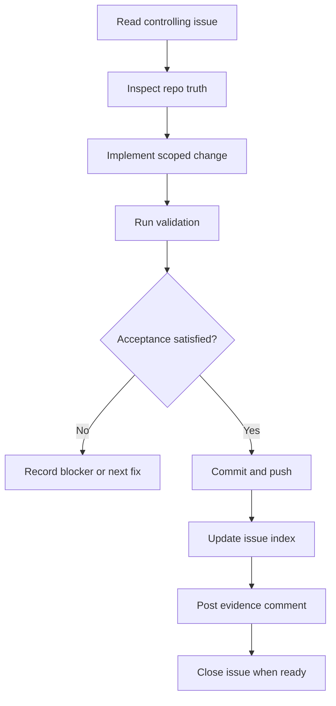

# Mermaid Example: Session Closeout Flow

Use this lane when the visual output is a process, dependency, sequence, or state transition.

## Good Uses

- session workflow;
- issue dependencies;
- source routing;
- app runtime architecture;
- state transitions.

## Rule

Keep diagrams close to the documentation they clarify. Do not create a diagram-only artifact unless the user asked for a diagram.
